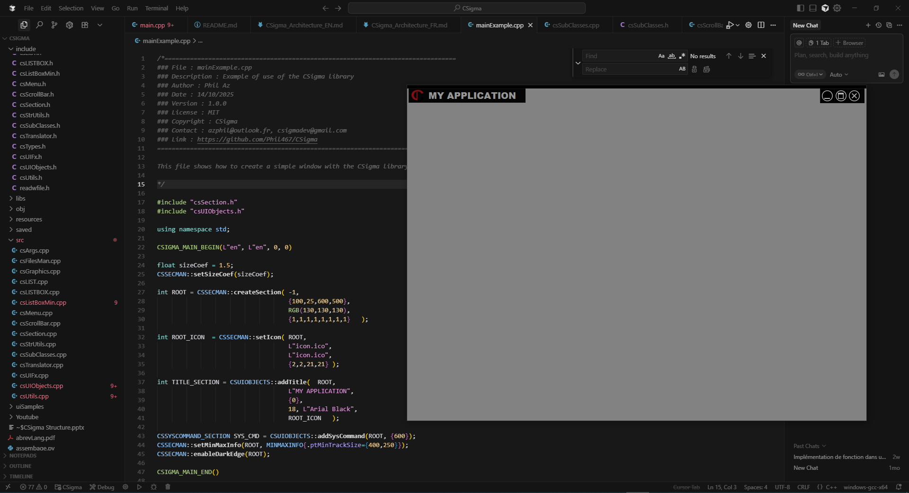

# 🧩 CSigma Framework

*A lightweight, native C++ framework for modern graphical interfaces*

---

## ⚙️ Overview

**CSigma** is a C++ framework currently under active development.  
It provides a **high-performance**, **fully native**, and **modular** environment for building modern graphical interfaces.

The framework focuses on two main technical pillars:

1. ⚙️ **A Win32-inspired grouped event system** for real-time control.  
2. 🌐 **An AI-assisted translation engine**, capable of switching interface language instantly with controlled translation quality.

---

## 🚧 Project Status

CSigma is currently distributed as **structured source files**, intended to be compiled using **Code::Blocks** or any C++17+ compiler.  
No static (`.lib`) or dynamic (`.dll`) library is available yet — compilation is done directly from the source.

---

## 🛠️ Installation & Compilation

### 🔹 Requirements
- **OS:** Windows 8 or later  
- **Compiler:** MinGW or Clang (C++17 minimum)  
- **IDE:** Code::Blocks (recommended for fast compilation); Cursor (efficient code editing)
- **Dependencies:** None (uses only Win32 and the C++ Standard Library)

### 🔹 Build with Code::Blocks
1. Clone the repository:
   ```bash
   git clone https://github.com/Phil467/CSigma.git
   ```
2. Open the project file:
   ```
   CSigma.cbp
   ```
3. Build and run the project.

### 🔹 Build manually (g++)
```bash
g++ -std=c++17 -Iinclude src/*.cpp main.cpp -o CSigmaApp.exe -ldwmapi -lgdi32 -luser32 -lkernel32 -lcomctl32 -lcomdlg32 -luxtheme -lmsimg32 -csArithmetic -csParallelTask -readwfile
```

---

## 🧩 Usage Example

```cpp
#include "csSection.h"
#include "csUIObjects.h"

CSIGMA_MAIN_BEGIN(L"en", L"en", 0, 0)

float sizeCoef = 1.5;
CSSECMAN::setSizeCoef(sizeCoef);

int ROOT = CSSECMAN::createSection( -1,
                                    {100,25,600,500},
                                    RGB(130,130,130),
                                    {1,1,1,1,1,1,1,1}   );

int ROOT_ICON  = CSSECMAN::setIcon( ROOT, 
                                    L"icon.ico", 
                                    L"icon.ico", 
                                    {2,2,21,21} );

int TITLE_SECTION = CSUIOBJECTS::addTitle(  ROOT, 
                                    L"MY APPLICATION",
                                    {0}, 
                                    18, L"Arial Black", 
                                    ROOT_ICON   );

CSSYSCOMMAND_SECTION SYS_CMD = CSUIOBJECTS::addSysCommand(ROOT, {600});
CSSECMAN::setMinMaxInfo(ROOT, MINMAXINFO{.ptMinTrackSize={400,250}});
CSSECMAN::enableDarkEdge(ROOT);

CSIGMA_MAIN_END()
```


---

## 🌐 Intelligent Translation

CSigma includes `CSLANGMAN`, an AI-assisted translation system that allows **instant language switching** with real-time quality control.  
All visible UI elements (titles, buttons, tooltips, dialogs) are updated immediately — no reloading or restarting required.

📘 See also:  
- [`docs/CSigma_Architecture_EN.md`](docs/CSigma_Architecture_EN.md)

---

## ⚙️ Event System

CSigma’s event model is based on **grouped callbacks** using native `WM_*` messages.  
This combines the low-latency efficiency of the Win32 API with a cleaner, modular API interface.

Example:
```cpp
CSUIMAN::addAction(BTN_ID, onButtonClick, 0);

void onButtonClick(CSARGS Args) {
    if (UINT(Args) == WM_LBUTTONUP)
        MessageBoxW(NULL, L"Button Clicked!", L"CSigma", MB_OK);
}
```

---

## 🧠 Development Goals

| Feature | Status |
|----------|---------|
| UI Components | ✅ some basic |
| fluid resizing | ✅ Done |
| Automatic layout saving | ✅ Done |
| Canvas | ✅ Functional, partial|
| Real-time event dispatching | ✅ Done |
| AI-powered translation engine | ✅ Functional |
| Static/Dynamic library build | 🚧 In progress |
| Cross-platform layer | 🧩 Planned |
| Documentation & API guide | 🚧 In progress |

---

## 📄 Documentation

| Document | Description |
|-----------|-------------|
| [`docs/CSigma_Architecture_EN.md`](docs/CSigma_Architecture_EN.md) | Technical overview (English) |
| [`docs/CSigma_Architecture_FR.md`](docs/CSigma_Architecture_FR.md) | Technical presentation (French) |

---

## 🤝 Contributing

Contributions will be welcome once the core API stabilizes.  
Developers are encouraged to explore the current source structure and suggest improvements via GitHub Issues.

---

## 📜 License

To be defined (prototype stage)

---

### 🔧 Maintainer
**Phil467**  
Developer and founder of the CSigma project  
[GitHub: Phil467](https://github.com/Phil467)

---
---

# 🧩 Framework CSigma

*Un framework C++ natif et léger pour les interfaces graphiques modernes*

---

## ⚙️ Vue d’ensemble

**CSigma** est un framework C++ actuellement en développement actif.  
Il offre un environnement **performant**, **entièrement natif** et **modulaire** pour la création d’interfaces graphiques modernes.

Le framework repose sur deux piliers techniques principaux :

1. ⚙️ **Un système d’évènements groupé**, inspiré de Win32, pour un contrôle en temps réel.  
2. 🌐 **Un moteur de traduction assistée par IA**, capable de changer instantanément la langue de l’interface tout en garantissant la qualité de traduction.

---

## 🚧 État du projet

CSigma est actuellement distribué sous forme de **fichiers sources structurés**, destinés à être compilés avec **Code::Blocks** ou tout compilateur compatible C++17+.  
Aucune bibliothèque statique (`.lib`) ou dynamique (`.dll`) n’est encore disponible — la compilation se fait directement à partir du code source.

---

## 🛠️ Installation & Compilation

### 🔹 Prérequis
- **Système :** Windows 8 ou supérieur  
- **Compilateur :** MinGW ou Clang (C++17 minimum)  
- **IDE :** Code::Blocks (recommandé pour compilation rapide); Cursor (édition efficace du code) 
- **Dépendances :** Aucune (Win32 + bibliothèque standard C++)

### 🔹 Compilation avec Code::Blocks
1. Clonez le dépôt :
   ```bash
   git clone https://github.com/Phil467/CSigma.git
   ```
2. Ouvrez le fichier de projet :
   ```
   CSigma.cbp
   ```
3. Compilez et exécutez le projet.

### 🔹 Compilation manuelle (g++)
```bash
g++ -std=c++17 -Iinclude src/*.cpp main.cpp -o CSigmaApp.exe -ldwmapi -lgdi32 -luser32 -lkernel32 -lcomctl32 -lcomdlg32 -luxtheme -lmsimg32 -csArithmetic -csParallelTask -readwfile
```

---

## 🧩 Exemple d’utilisation

```cpp
#include "csSection.h"
#include "csUIObjects.h"

CSIGMA_MAIN_BEGIN(L"en", L"en", 0, 0)

float sizeCoef = 1.5;
CSSECMAN::setSizeCoef(sizeCoef);

int ROOT = CSSECMAN::createSection( -1,
                                    {100,25,600,500},
                                    RGB(130,130,130),
                                    {1,1,1,1,1,1,1,1}   );

int ROOT_ICON  = CSSECMAN::setIcon( ROOT, 
                                    L"icon.ico", 
                                    L"icon.ico", 
                                    {2,2,21,21} );

int TITLE_SECTION = CSUIOBJECTS::addTitle(  ROOT, 
                                    L"MY APPLICATION",
                                    {0}, 
                                    18, L"Arial Black", 
                                    ROOT_ICON   );

CSSYSCOMMAND_SECTION SYS_CMD = CSUIOBJECTS::addSysCommand(ROOT, {600});
CSSECMAN::setMinMaxInfo(ROOT, MINMAXINFO{.ptMinTrackSize={400,250}});
CSSECMAN::enableDarkEdge(ROOT);

CSIGMA_MAIN_END()
```


---

## 🌐 Traduction intelligente

CSigma intègre **`CSLANGMAN`**, un système de traduction assisté par IA permettant de **changer de langue instantanément** avec un contrôle qualité en temps réel.  
Tous les éléments visibles de l’interface (titres, boutons, info-bulles, dialogues) sont mis à jour immédiatement, sans rechargement ni redémarrage.

📗 Voir aussi :  
- [`docs/CSigma_Architecture_FR.md`](docs/CSigma_Architecture_FR.md)

---

## ⚙️ Système d’évènements

Le modèle d’évènements de CSigma repose sur des **callbacks groupés** utilisant les messages `WM_*` de Win32.  
Il combine la **faible latence du système natif Windows** avec une API moderne et modulaire.

Exemple :
```cpp
CSUIMAN::addAction(BTN_ID, onButtonClick, 0);

void onButtonClick(CSARGS Args) {
    if (UINT(Args) == WM_LBUTTONUP)
        MessageBoxW(NULL, L"Bouton cliqué !", L"CSigma", MB_OK);
}
```

---

## 🧠 Objectifs de développement

| Fonctionnalité | Statut |
|----------------|--------|
| Composantes UI | ✅ de base |
| Redimensionnement fluide | ✅ Terminée |
| Sauvegarde automatique de la géométrie | ✅ Terminée |
| Caneva | ✅ Fonctionnel, partiel|
| Distribution des évènements en temps réel | ✅ Terminée |
| Moteur de traduction assistée par IA | ✅ Fonctionnel |
| Compilation en bibliothèque (statique/dynamique) | 🚧 En cours |
| Compatibilité multiplateforme | 🧩 Prévue |
| Documentation et guide API | 🚧 En cours |

---

## 📄 Documentation

| Document | Description |
|-----------|-------------|
| [`docs/CSigma_Architecture_EN.md`](docs/CSigma_Architecture_EN.md) | Présentation technique (anglais) |
| [`docs/CSigma_Architecture_FR.md`](docs/CSigma_Architecture_FR.md) | Présentation technique (français) |

---

## 🤝 Contribution

Les contributions seront les bienvenues une fois que l’API principale sera stabilisée.  
Les développeurs peuvent dès à présent explorer la structure du code et proposer des améliorations via les *Issues* GitHub.

---

## 📜 Licence

À définir (phase prototype)

---

### 🔧 Mainteneur

**Phil467**  
Développeur et fondateur du projet CSigma  
[GitHub : Phil467](https://github.com/Phil467)
